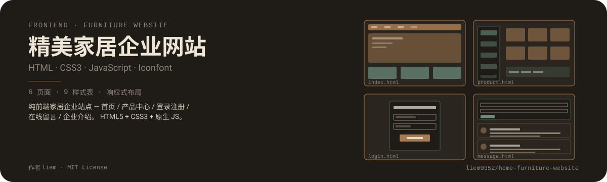
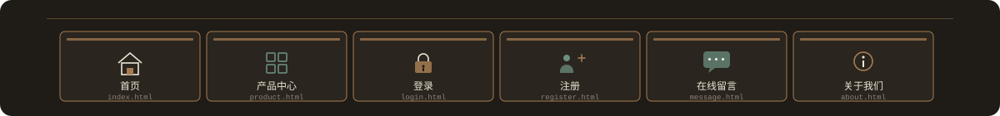
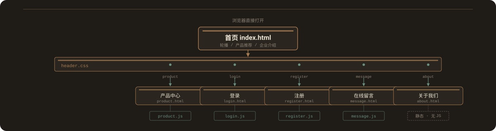
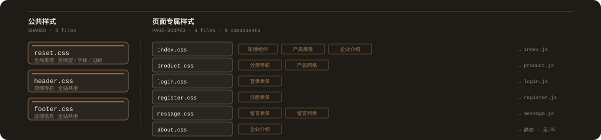
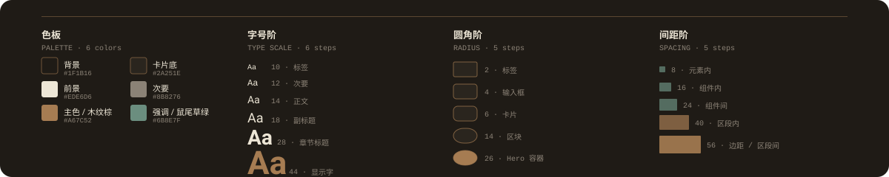
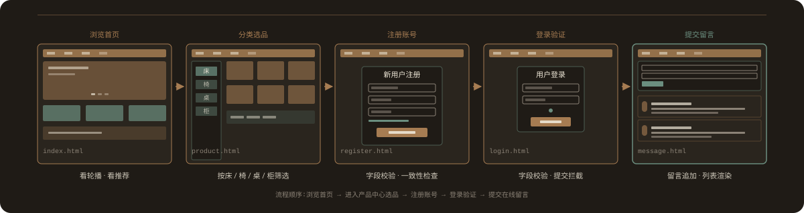
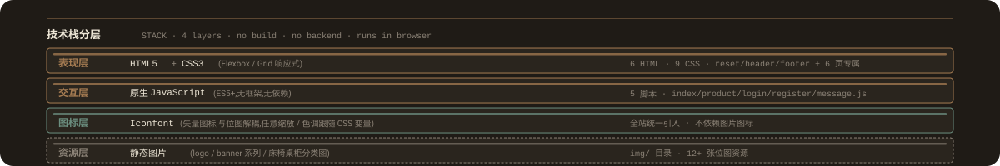
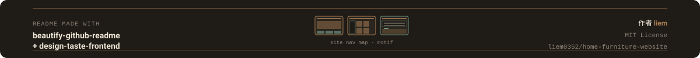

<p align="center">
  
</p>

# 精美家居企业网站

> 纯前端家居企业站点 - 首页、产品中心、登录注册、在线留言、企业介绍。基于 HTML5 / CSS3 / 原生 JavaScript 与 Iconfont 矢量图标构建,浏览器直接打开即可运行,无后端、无构建步骤。

## 页面展示

<p align="center">
  
</p>

| 页面 | 文件 | 职责 |
| --- | --- | --- |
| 首页 | `index.html` | 欢迎栏 / 导航 / 轮播 / 产品推荐 / 企业介绍 / 底部 |
| 产品中心 | `product.html` | 产品分类(床 / 椅 / 桌 / 柜)与网格展示 |
| 登录 | `login.html` | 用户登录表单与字段校验 |
| 注册 | `register.html` | 新用户注册表单与字段校验 |
| 在线留言 | `message.html` | 留言表单与留言列表 |
| 关于我们 | `about.html` | 企业介绍页面(静态,无脚本) |

## 页面架构

<p align="center">
  
</p>

站点入口为 `index.html`,通过 `header.css` 提供的全站统一顶部导航条,链接到五个二级页面。每个二级页面顶部继承同一导航条样式,保持视觉一致性。`about.html` 为纯静态页面,无对应 JavaScript 脚本;其余五页均配有专属脚本处理交互逻辑。

## 组件设计

<p align="center">
  
</p>

样式按"公共 / 页面专属"两层组织,避免相互污染。公共层包含全局重置、全站顶部导航与底部信息三份样式;页面专属层为每个页面单独抽离一份 CSS,各自包含该页独有的组件。脚本与专属 CSS 一一对应,文件名同名(如 `product.css` 与 `product.js`),便于按页维护。

### 样式表清单

- 公共样式:`css/reset.css` / `css/header.css` / `css/footer.css`
- 页面专属:`css/index.css` / `css/product.css` / `css/login.css` / `css/register.css` / `css/message.css` / `css/about.css`

### 脚本清单

- `js/index.js` - 首页轮播切换与自动播放
- `js/product.js` - 产品分类筛选与网格更新
- `js/login.js` - 登录表单字段校验
- `js/register.js` - 注册表单字段校验与一致性检查
- `js/message.js` - 留言追加与列表渲染

## 设计令牌

<p align="center">
  
</p>

色板延续家居杂志风:深木色暖黑作为背景,卡片底为更浅一阶的木色,前景使用暖米白保证可读性。木纹棕作为主色用于按钮、链接与强调元素,鼠尾草绿作为次强调色用于分类、状态与表单焦点。

| 类别 | 令牌 | 数值 |
| --- | --- | --- |
| 背景色 | `#1F1B16` | 深木色暖黑 |
| 卡片底 | `#2A251E` | 木色深一阶 |
| 前景色 | `#EDE6D6` | 暖米白 |
| 次要文字 | `#8B8276` | 中木色灰 |
| 主色 | `#A67C52` | 木纹棕 |
| 强调色 | `#6B8E7F` | 鼠尾草绿 |

## 用户旅程

<p align="center">
  
</p>

访客典型路径:从首页浏览轮播与推荐产品开始,进入产品中心按床 / 椅 / 桌 / 柜分类筛选,如需进一步咨询则注册并登录账号,最后在在线留言页提交表单完成交互。所有页面顶部均保留全站统一导航条,可在任意位置跳转。

## 技术栈

<p align="center">
  
</p>

技术栈分为四层,均为浏览器原生能力,无需构建工具与运行时依赖:

- **表现层**:HTML5 提供语义结构,CSS3(含 Flexbox 与 Grid)负责响应式布局
- **交互层**:原生 JavaScript(ES5+)实现轮播、筛选、表单校验、留言渲染等逻辑,无任何前端框架
- **图标层**:Iconfont 矢量图标与位图资源解耦,任意缩放不失真,色调可跟随 CSS 变量调整
- **资源层**:`img/` 目录下的 logo、banner 系列、床 / 椅 / 桌 / 柜分类图等位图资源

## 如何使用

无需安装依赖,无需构建步骤。克隆仓库后用浏览器直接打开 `index.html` 即可完整预览全部页面。

```bash
# 1. 克隆仓库
git clone https://github.com/liem0352/home-furniture-website.git

# 2. 进入目录
cd home-furniture-website

# 3. 直接用浏览器打开首页
#    Windows: start index.html
#    macOS:   open index.html
#    Linux:   xdg-open index.html
```

或在文件管理器中双击 `index.html`,即可在默认浏览器中预览全部页面。

### 兼容性

- 现代浏览器最新版:Chrome / Edge / Firefox / Safari
- 依赖 CSS Flexbox / Grid 与 ES5+ 语法,不支持 IE

### 资源清单

| 类别 | 数量 | 说明 |
| --- | --- | --- |
| HTML 页面 | 6 | index / product / login / register / message / about |
| 样式表 | 9 | reset / header / footer + 6 页专属 |
| 脚本 | 5 | index / product / login / register / message |
| 图片资源 | 12+ | logo / banner 系列 / 床椅桌柜分类图等 |

<p align="center">
  
</p>

## License

MIT License - 作者 **liem**。本仓库代码与资源可自由用于学习与商业参考,引用时请保留作者署名。
